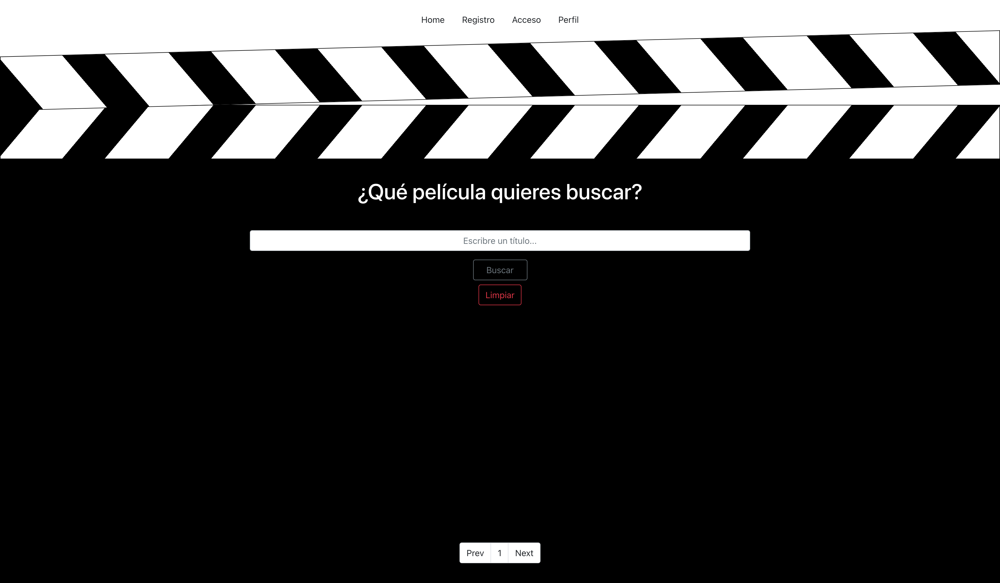

# Bajabajo Challenge

## 1. Descripción 

Aplicación web para la búsqueda de peliculas mediante su titulo en la que el usuario, una vez registrado, podrá crear su propia lista de peliculas favoritas.

## 2. Descripción funcional

Los usuarios podrán interactuar de las siguientes maneras en esta página web: 
- Buscando películas por su título y paginando para ver todas aquellas que coincidan.
- Seleccionando una película en concreto, lo que les redigirá a una nueva vista de esa misma película con información más detallada y la opción de añadirla a su lista de favoritas.

La barra de navegación web cuenta con 4 links sobre los que navegar:
- HOME
- REGISTRO
- ACCESO
- PERFIL

## Uso:

Clonar repositorio en local e iniciarlizar la aplicación en terminal mediante el comando ```npm run dev```

## 3. Descripción técnica Back-End.

A continuación se muestra un esquema de los modelos que serán la base de toda la información mostrada en la web, asi como las rutas para crear y acceder a los datos:

- USUARIO: id, email y contraseña.

    1. POST: /auth/signup.
        Ruta publica para registro de nuevo usuario.
    2. POST: /auth/login.
        Ruta publica para login de usuario ya registrado.


- FILMS: id, título e id del usuario que la añada a favoritos.

    1. GET: api/search/:filmName/:page.
        Ruta pública en la que se realiza la búsqueda de películas mediante su título.
    2. GET: api/film/:id.
        Ruta publica para ver la información de una película en concreto.
    3. POST: api/catalog.
        Ruta privada para añadir una película a favoritas.
    4. GET: api/catalog/likes.
        Ruta privada para ver todas las películas favoritas del usuario.

Para comprobar la autentificación del usuario contamos con un middleware que se encarga de revisar el token del mismo, dandole asi, acceso a las rutas privadas.

También se realizar las validaciones previas a la creación de cualquier usuario.

## 4. Descripción técnica Front-End.

A continuación se describen los componentes de la parte FrontEnd y sus utilidades:

Todas las llamadas y envíos de información desde/al back-end, se realizan mediante Axios.

- Home.jsx:
    <br/>
    Se realiza una llamada al Back-End en la ruta ```GET: /api/search/:filmName/:page``` en la cual se envía el título recogido mediante un input y el número de página de busqueda, que por defecto será la 1. 

    El acceso a esta vista será ```'/'```

- SignUp.jsx:
    <br/>
    Se realiza post al Back-End en la ruta ```POST: /auth/signup```, envíandole los datos previamente recogidos mediante un formulario completado por el nuevo usuario. Declaramos un ```useState({})``` inicial de objeto con keys cuyos valores están vacíos, que serán rellenados a traves del formulario.

    Además, se creará el token de acceso con ```localStorage.setItem()``` y mediante la función ```setAuthToken()``` damos acceso al usuario a todas aquellas llamadas que se realicen a traves de Axios.

    El acceso a esta vista será ```'/signup'```.

- Login.jsx:
    <br/>
    Del mismo modo, se realiza post al Back-End en la ruta ```POST: /auth/login```, envíandole los datos previamente recogidos mediante un formulario completado por el usuario ya registrado anteriormente. Declaramos un ```useState({})``` inicial de objeto con keys cuyos valores están vacíos, que serán rellenados a traves del formulario.

    Además, se creará el token de acceso con ```localStorage.setItem()``` y mediante la función ```setAuthToken()``` damos acceso al usuario a todas aquellas llamadas que se realicen a traves de Axios.

    El acceso a esta vista será ```'/login'```.

- Profile.jsx:
    <br/>
    Se realiza llamada al Back-End en la ruta ```GET: /api/catalog/likes``` solicitando la respuesta de las películas favoritas del usuario según la ID del mismo incluida en el token.

    Declaramos un ```useState([])``` inicial como array vacía, que serán rellenados con los datos recibidos desde el servidor.

    Creamos la función ```logOut()``` a través de la cual eliminamos el token:  ```localStorage.removeItem()``` y a su vez redirigimos al usuario a la vista de ```'/'```.

    El acceso a esta vista será ```'/profile'```.

- Film.jsx:
    <br/>
    Realizamos la llamada al Back-End mediante la ruta ```GET: /api/film/:id```.
    Se declara el ```useState({})``` inicialmente vacío, que será rellenado con los datos de la película con el ID correspondiente.

    Contamos con la función ```addFilm()``` que permitirá al usuario añadir esta película como favorita mediante un sencillo botón, y tras lo que, en caso de realizarse con éxito, le aparecerá una confirmación en pantalla.

    El acceso a esta vista será ```'/film/:id'```.

- Navbar.jsx:
    <br/>
    NavBar creada con Boostrap y ```Links``` gestionados con react-router-dom.


## 5. Tecnologías

Para este proyecto MERN, se han utilizado las siguientes tecnologías de desarrollo web:

- HTML.
- CSS.
- Boostrap.
- Vanilla JS.
- GitHub.
- API y Json.
- Postman.
- NodeJS: npm, express, nodemon, dotenv, validator, mongoose, bycript, jwt, axios, cors, concurrently.
- MongoDB.
- React.

## 6. Versiones:
v.1.0 Primera Version (09/05/21)



